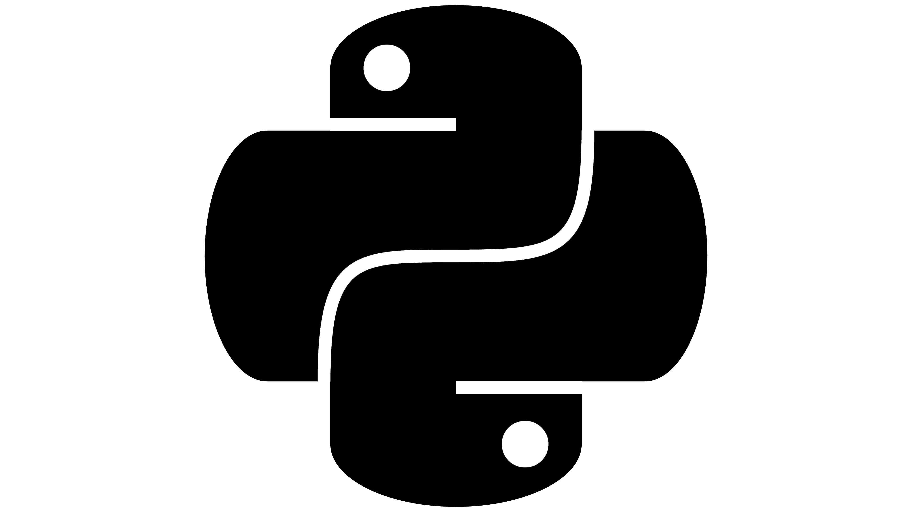

# Automação de Testes de API com Robot Framework e Python Requests Library.

<h1 align="center">
    
    
</h1>

## Pré-requisitos

[Python](https://www.python.org/downloads/) 3.10 ou superior.


## Instalação

```
pip install -r requirements.txt
```

## Execução dos Testes

```
robot -d ./logs tests/
``````

## Relatórios

Verifique a pasta `logs` caso queira visualizar os relatórios da execução.

Para visualizá-los, abra o arquivo `report.html` ou `log.html` que é mais detalhado.

---

Feito com 💜 &nbsp;por Thiago Nogueira dos Santos ✅ &nbsp;[Meu linkedin](https://www.linkedin.com/in/thinogueiras/) ✅